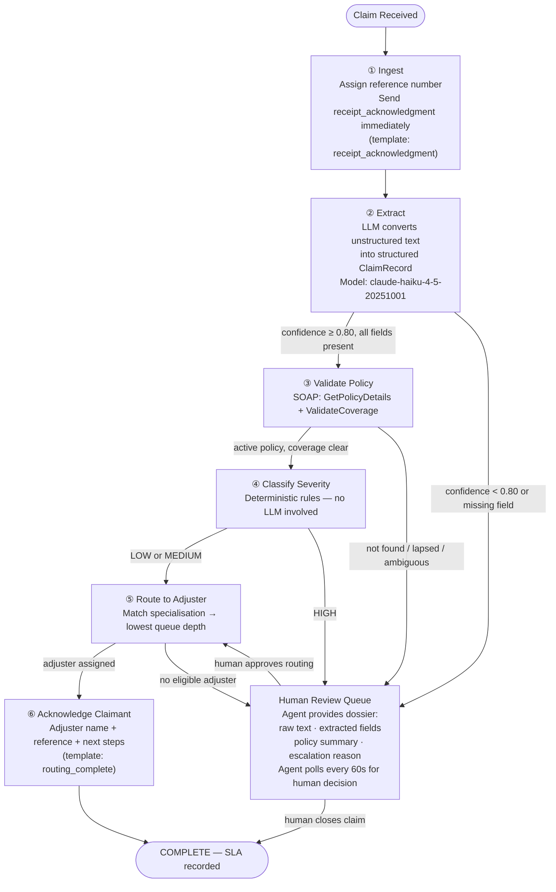
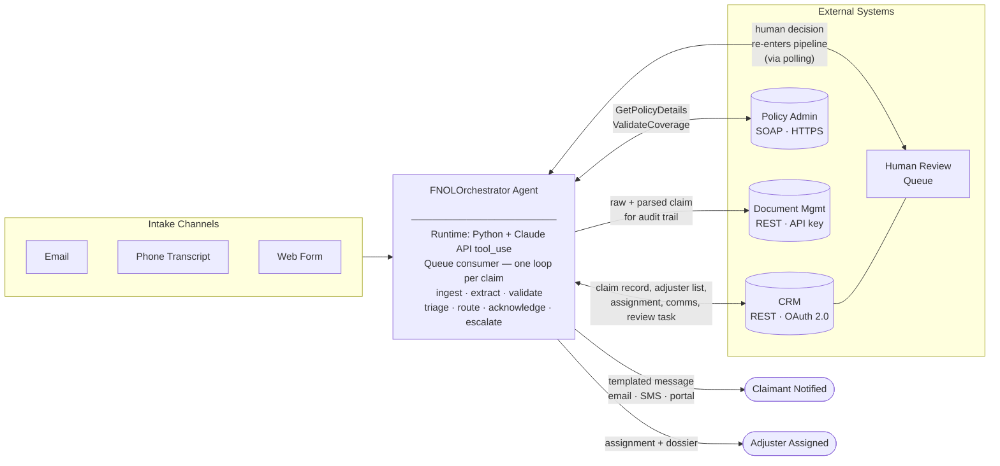
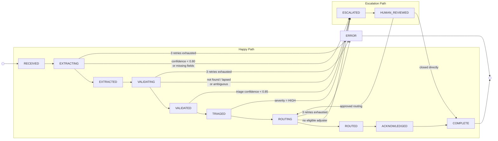
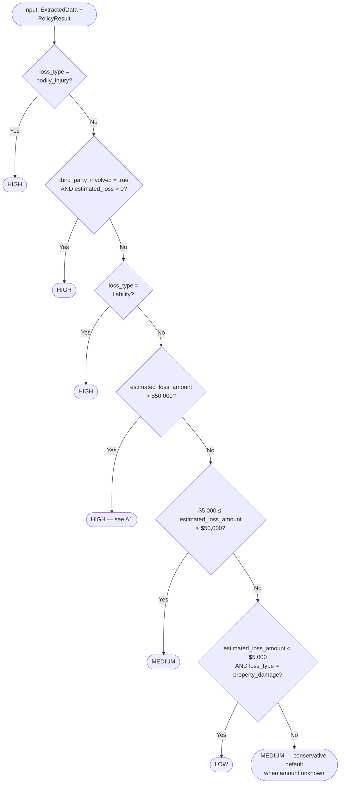
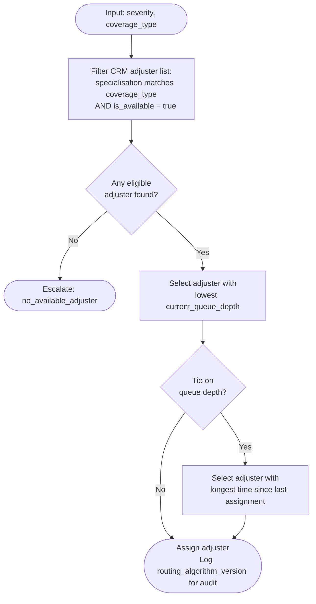

# Gate 1 — AI-Native Specification (v2)
**Candidate:** Richa Sang
**Scenario:** FNOL Agentic Processing — Insurance Claims
**Version note:** v2 closes the five Red buildability gaps identified in the companion gap analysis. Changes from v1 are marked with `[GAP-FIX]`.

---

## Deliverable 1: Problem Statement & Success Metrics

### Problem: Claimant Perspective

A claimant who has just experienced a loss — a car accident, a burst pipe, a fire — contacts their insurer at their most stressed. The current system forces them to wait up to 2 hours for acknowledgment, with no visibility into where their claim is or who owns it. The 18% routing error rate means roughly 54 claims per day end up with the wrong adjuster; those claimants get called back, re-explain their situation, and wait again. The 31% SLA breach rate means nearly 1 in 3 claimants does not even receive basic acknowledgment within the promised window. The problem is not just operational inefficiency — it is a failure of a basic service promise at the moment a customer most needs it.

### Problem: Business Perspective

At 300 claims per day and 22 minutes average handling time, the 12-specialist team is operating at ~110 claims/day theoretical capacity per specialist, but the pipeline is clearly saturated: 31% of claims breach the 2-hour SLA. The math shows the team is working at the limit. The 18% routing error rate compounds downstream: misrouted claims require rework, delay settlement, and increase adjuster idle time in the wrong queues. The business is paying for a high-headcount manual process that still fails nearly 1 in 3 customers on the most basic metric.

The opportunity is not to replace judgment — it is to remove the 80% of FNOL processing that is deterministic (lookup, match, template, route) so that human specialists focus only on the 20% that genuinely requires judgment.

### Success Metrics

All metrics measured 30 days post-full-deployment, compared to current baseline. Targets below are derived from first principles against the scenario's numbers — they are not industry benchmarks. They must be confirmed as acceptable with the client before being used as go/no-go criteria (see D5.A8).

| Metric | Baseline | Target | Derivation |
|---|---|---|---|
| SLA breach rate | 31% | ≤ 5% | The 31% breach rate is caused by manual processing at 22 min/claim overwhelming the team at peak load. An agent completes extraction + routing in < 2 min for automated claims, eliminating the queue saturation that causes breaches. 5% accounts for residual breaches on escalated claims awaiting human review. |
| Routing error rate | 18% | ≤ 3% | The current 18% error is consistent with human error under cognitive load and repetitive tasks. Deterministic rule-based routing (same rules, every time, no fatigue) should outperform this substantially. 3% accounts for cases where the routing rules are ambiguous or adjuster data is stale — not zero, because the routing logic itself may have edge cases. |
| Avg handling time — automated path | 22 min | ≤ 4 min | Agent steps: LLM extraction (~30s), SOAP policy lookup (~10s), severity rule eval (~1s), CRM routing call (~5s), acknowledgment send (~5s). Total < 2 min processing; 4 min target includes queue wait and retry headroom. |
| Avg handling time — human-reviewed path | 22 min | ≤ 12 min | Agent pre-processes and surfaces structured dossier, so human reviewer does not re-read raw text or look up policy manually. Estimated 5–8 min for human decision; 12 min allows for queue wait. Still nearly halves current handling time for these claims. |
| Claimant acknowledgment latency (p95) | Unknown (not measured today) | ≤ 15 min | Agent sends initial receipt acknowledgment immediately on intake, before full processing. 15 min p95 accounts for email delivery delays and retry scenarios. Target is aspirational without a current baseline — must be measured in shadow mode (see D4). |
| Human specialist capacity freed | 0% | ≥ 60% | If ≥ 65% of claims are fully automated (see row below), and automated claims currently occupy ~65% of specialist time at 22 min each, freeing those claims frees ≥ 60% of specialist capacity. This is the headroom the business needs to handle volume growth or reassign staff to settlement. |
| Claims requiring no human intervention | 0% | ≥ 65% | This is an assumption about the severity distribution: if roughly 65% of claims are LOW/MEDIUM with unambiguous coverage and clear extraction, they will complete the automated path. The actual split is unknown — see D5.U2. Shadow mode will calibrate this before go-live. |

**Safety metric (not an efficiency target):** False-negative escalation rate — agent routes a HIGH-severity or legally ambiguous claim through the automated path without human review — must be < 1%. This is a hard constraint. If this metric exceeds 1% in shadow mode, go-live is blocked regardless of efficiency gains.

---

## Deliverable 2: Delegation Analysis

FNOL processing has five logical steps. Each is assessed separately.

### Step 1: Claim Ingestion & Structured Extraction
**Decision: Fully Agentic**

Converting unstructured text (email, phone transcript, web form) into a structured claim record is a document extraction problem. The inputs are bounded (text describing an incident), the output schema is fixed (see Deliverable 3), and the quality is measurable via confidence scores. No judgment is required — only accuracy. If extraction confidence is below threshold, the agent escalates rather than guesses. There is no value in a human doing this step for clear cases; the value of human involvement is preserved for the escalation path.

### Step 2: Policy Lookup & Coverage Validation
**Decision: Fully Agentic for lookup; Agent-led with Human Oversight for coverage interpretation**

Looking up a policy number and checking whether the loss type falls within declared coverage is a deterministic query: call the policy admin system, compare coverage types against incident type, return a binary result. This is fully agentic.

Coverage interpretation becomes ambiguous when: the policy has exclusions that require contextual reading, the incident type is borderline (e.g., "water damage" that may or may not be flood), or the policy is in a non-standard state (grace period, pending renewal). These cases require human oversight. The agent flags them with the reason; a specialist makes the coverage call. Automating this boundary would risk wrongful denial or approval — both carry legal and financial exposure.

### Step 3: Severity Triage
**Decision: Agent-led with Human Oversight for HIGH severity**

Severity classification is codifiable: it is a function of loss type, estimated loss amount, injury flags, and policy limit. The thresholds are defined (see Deliverable 3). For LOW and MEDIUM claims, the agent's classification is authoritative. For HIGH severity claims — or any claim where the agent's confidence in the severity score is below threshold — a human reviewer confirms before routing. This boundary is drawn because a miscategorised high-severity claim (e.g., bodily injury routed as property-only) has disproportionate downstream consequences: regulatory exposure, bad-faith handling claims, and wrong adjuster type.

### Step 4: Adjuster Routing
**Decision: Agent-led with Human Oversight for escalated claims; Fully Agentic for LOW/MEDIUM claims**

Routing logic is codifiable: match coverage specialisation, then minimise queue depth among eligible adjusters (see Deliverable 3, routing algorithm). The 18% current error rate is not evidence that routing is inherently ambiguous — it is evidence that manual routing under cognitive load is error-prone. An agent following deterministic routing rules should outperform this significantly.

For claims already escalated to human review (HIGH severity or ambiguous coverage), the human reviewer confirms or overrides the agent's routing suggestion. This is agent support for a human decision, not the reverse.

### Step 5: Claimant Acknowledgment
**Decision: Fully Agentic**

Acknowledgment is a templated communication triggered by state transition. Two acknowledgments are sent per automated claim: an immediate receipt ACK on intake (before any processing), and a routing-complete ACK after adjuster assignment. The content is parameterised (reference number, claim type, assigned adjuster name, expected next-contact window). There is no judgment involved. Sending templated acknowledgments within minutes of receipt is a capability gap today only because humans are doing higher-value work simultaneously — an agent can do this instantly and correctly every time.

### Step 6: Human Review Queue Management
**Decision: Human-led with Agent Support**

When a claim enters the human review queue, the agent surfaces a structured dossier: extracted claim data, policy coverage summary, the specific escalation reason, and adjuster queue status. The human makes the decision. The agent does not suggest an outcome — it provides information. This is intentional: the human's value is judgment, not information retrieval.

### Delegation Summary

| FNOL Step | Mode | Automated | Rationale |
|---|---|---|---|
| Claim ingestion & extraction | Fully Agentic | ~100% (escalates on low confidence) | Bounded input, fixed output schema, measurable confidence |
| Policy lookup | Fully Agentic | 100% | Deterministic API query — no judgment |
| Coverage interpretation | Agent-led + Human Oversight | ~80% | Exclusion clauses and borderline loss types carry legal risk if misread |
| Severity triage | Agent-led + Human Oversight (HIGH only) | ~70% | Miscategorising HIGH creates regulatory and bad-faith exposure |
| Adjuster routing | Fully Agentic (LOW/MEDIUM); Human Oversight (escalated) | ~65% | Deterministic rule set; human confirms only on already-escalated claims |
| Claimant acknowledgment | Fully Agentic | 100% | Templated, parameterised, no judgment required |
| Human review queue | Human-led + Agent Support | 0% automated decisions | Agent provides dossier; human retains full decision authority |

---

## Deliverable 3: Agent Specification

### End-to-End Claim Flow

The happy path runs straight down. Any step can branch right into the Human Review Queue; the human decision re-enters the pipeline at routing. Two acknowledgments are sent: one immediately on intake, one after routing is complete.



### System Architecture

The agent is the central orchestrator. It reads from intake channels, calls three external systems, and produces two outputs: a claimant acknowledgment and an adjuster assignment. The Human Review Queue is managed inside the CRM and feeds decisions back to the agent via polling.



### 3.1 Purpose & Scope

**Agent name:** `FNOLOrchestrator`

**Purpose:** Process incoming FNOL reports end-to-end — from unstructured intake to adjuster routing and claimant acknowledgment — within a 2-hour SLA. Escalate to human review when decision confidence is below threshold or claim characteristics exceed defined risk boundaries.

**In scope:** Email, phone transcript, and web form FNOL intake. Policy lookup against legacy system. Severity classification. Adjuster routing. Claimant acknowledgment. Human escalation queue management.

**Out of scope:** Claim settlement decisions. Fraud investigation. Policy changes. Any action after initial adjuster assignment.

**[GAP-FIX 1] Runtime:** `FNOLOrchestrator` is a Python process using the Claude API with `tool_use`. Each incoming FNOL report is consumed from a message queue (SQS or equivalent — see D5.A6); the queue consumer spawns a synchronous agent loop per claim. The agent loop calls the tools defined in §3.7 and exits when the claim reaches `COMPLETE`, `ESCALATED`, or `ERROR` state. There is no persistent agent session between claims — each claim is an independent invocation. The orchestrator model is `claude-sonnet-4-6`; it has access to all tools in §3.7 and decides tool call order. The extraction sub-call within `parse_claim_document` uses `claude-haiku-4-5-20251001` (see §3.4).

---

### 3.2 Data Entities

```
ClaimRecord {
  id: UUID                            # system-generated on intake
  source: "email" | "phone_transcript" | "web_form"
  raw_content: string                 # original unstructured text, immutable
  received_at: ISO8601                # timestamp of first system receipt

  extracted: ExtractedData | null
  policy: PolicyResult | null
  triage: TriageResult | null
  routing: RoutingResult | null
  acknowledgment: AcknowledgmentResult | null

  state: ClaimState                   # see state model below
  escalation_reason: string | null    # populated if state is ESCALATED
  audit_log: AuditEntry[]             # append-only; every state transition logged
}

ExtractedData {
  claimant_name: string
  claimant_contact: { email: string | null, phone: string | null }
  policy_number: string
  incident_date: ISO8601 date
  incident_description: string        # normalised prose, max 500 chars
  loss_type: "property_damage" | "bodily_injury" | "liability" | "theft" | "other"
  estimated_loss_amount: number | null  # USD; null if not stated
  third_party_involved: boolean
  extraction_confidence: float        # 0.0–1.0; calculated from required field coverage (see §3.4)
  missing_fields: string[]            # names of required fields not found
}

PolicyResult {
  policy_number: string
  policy_status: "active" | "lapsed" | "grace_period" | "not_found"
  coverage_types: string[]
  coverage_limit: number              # USD
  deductible: number                  # USD
  loss_type_covered: boolean | null   # null = ambiguous, requires human
  coverage_notes: string | null       # reason for ambiguity if null
}

TriageResult {
  severity: "HIGH" | "MEDIUM" | "LOW"
  severity_reason: string
  confidence: float                   # 0.0–1.0
  requires_human_review: boolean
}

RoutingResult {
  assigned_adjuster_id: string | null
  adjuster_name: string | null
  adjuster_specialisation: string
  routing_algorithm_version: string
  routed_at: ISO8601 | null
}

AcknowledgmentResult {
  sent_at: ISO8601
  channel: "email" | "sms" | "portal"
  template_id: string
  reference_number: string            # claim ID formatted for claimant-facing use
}

AuditEntry {
  timestamp: ISO8601
  action: string
  actor: "agent" | "human:{user_id}"
  previous_state: ClaimState
  new_state: ClaimState
  metadata: object
}
```

---

### 3.3 State Model

The happy path runs left to right across the top. Escalation drops into the lower lane; the human decision either re-enters at ROUTING or closes the claim directly. ERROR is a terminal state that triggers an ops alert.



**State reference:**

| State | Description |
|---|---|
| `RECEIVED` | Raw claim persisted to CRM; reference number assigned; receipt_acknowledgment sent |
| `EXTRACTING` | LLM extraction in progress |
| `EXTRACTED` | Structured `ExtractedData` available; policy lookup pending |
| `VALIDATING` | SOAP call to policy admin in flight |
| `VALIDATED` | Coverage confirmed binary; severity classification pending |
| `TRIAGED` | Severity assigned; routing pending |
| `ROUTING` | Adjuster query in flight |
| `ROUTED` | Adjuster assigned; routing_complete acknowledgment pending |
| `ACKNOWLEDGED` | Claimant notified (routing_complete); claim on automated path done |
| `ESCALATED` | In human review queue; SLA clock still running |
| `HUMAN_REVIEWED` | Human action recorded; re-entering pipeline |
| `COMPLETE` | All steps done; SLA outcome recorded |
| `ERROR` | Unrecoverable failure; ops alert triggered; claim held for manual triage |

---

### 3.4 Decision Logic

#### [GAP-FIX 2] LLM Extraction — Model, Prompt & Confidence Formula

**Model:** `claude-haiku-4-5-20251001` (Claude Haiku 4.5). Chosen for latency (< 1s typical) and cost-efficiency; extraction is a structured data task, not a reasoning task. The orchestrator model (`claude-sonnet-4-6`) delegates extraction as a tool call to this model.

**System prompt (skeleton — refine against real claim samples during shadow mode):**

```
You are a claims extraction assistant for an insurance company.
Your task is to extract structured data from the FNOL (first notice of loss) text provided.
Return ONLY a valid JSON object matching the schema below. Do not infer or assume facts not
explicitly stated in the text. If a required field cannot be determined, set it to null and
add the field name to missing_fields. Do not fabricate policy numbers, dates, or amounts.
```

**User prompt template:**

```
Extract FNOL claim data from the following {source} submission.

---
{raw_content}
---

Return JSON with exactly these fields:
{
  "claimant_name": string | null,
  "claimant_contact": {"email": string | null, "phone": string | null},
  "policy_number": string | null,
  "incident_date": "YYYY-MM-DD" | null,
  "incident_description": string (max 500 chars, normalised prose) | null,
  "loss_type": "property_damage" | "bodily_injury" | "liability" | "theft" | "other" | null,
  "estimated_loss_amount": number (USD) | null,
  "third_party_involved": true | false | null,
  "missing_fields": [list of required field names that could not be determined]
}
```

**`extraction_confidence` formula:**

```python
REQUIRED_FIELDS = [
    "claimant_name",
    "policy_number",
    "incident_date",
    "incident_description",
    "loss_type",
    "third_party_involved",
]

def calculate_extraction_confidence(llm_output: dict) -> float:
    extracted_count = sum(
        1 for f in REQUIRED_FIELDS
        if llm_output.get(f) is not None
        and f not in llm_output.get("missing_fields", [])
    )
    return extracted_count / len(REQUIRED_FIELDS)
```

`extraction_confidence` = (number of required fields with non-null values not listed in `missing_fields`) / 6.

Optional fields (`estimated_loss_amount`, `claimant_contact`) do not affect the score. The 0.80 threshold means 5 out of 6 required fields must be populated; a missing `policy_number` or `loss_type` alone causes escalation. This is intentional — propagating bad data downstream is worse than escalating.

---

**Extraction confidence threshold:** 0.80. Below this, the agent cannot be confident the structured data accurately represents the original claim. Escalate rather than propagate bad data.

**Severity classification rules (evaluated in order; first match wins):**



**Routing algorithm:**



---

### 3.5 Escalation Triggers

Any of the following immediately transitions the claim to ESCALATED:

| Trigger | Reason Code |
|---|---|
| extraction_confidence < 0.80 | `low_extraction_confidence` |
| Any required field in missing_fields | `missing_required_field:{field_name}` |
| policy_status = "not_found" | `policy_not_found` |
| policy_status = "lapsed" OR "grace_period" | `policy_status_requires_review` |
| loss_type_covered = null | `coverage_ambiguous` |
| severity = "HIGH" | `high_severity` |
| triage confidence < 0.85 | `low_triage_confidence` |
| No eligible adjuster found after routing | `no_available_adjuster` |
| Same policy has open claim < 30 days old | `potential_duplicate_or_fraud` |
| Policy system unavailable after 3 retries | `policy_system_unavailable` |

Human reviewers see: raw claim text, all extracted fields with confidence scores, policy summary, escalation reason, and the agent's suggested routing (marked as suggestion, not decision).

**Human review SLA:** 90 minutes from receipt (leaving 30 minutes for pre-escalation processing and post-review routing/acknowledgment). If human review queue has claims older than 60 minutes, alert ops team lead.

**[GAP-FIX 3] Human review re-entry mechanism:** After creating a review task via `POST /review-queue`, the agent polls `GET /review-queue/{task_id}` every 60 seconds. When the response returns `status = "completed"`, the agent reads `human_decision` from the response body and acts as follows:

| `human_decision.action` | Agent behaviour |
|---|---|
| `"approve_routing"` | Re-enters pipeline at ROUTING step; applies any field updates in `human_decision.updates` before re-running routing algorithm |
| `"close_claim"` | Transitions claim directly to COMPLETE; sends `escalation_notice` acknowledgment if not previously sent |
| `"reject"` | Transitions claim to ERROR; logs `human_decision.notes` in audit trail; pages ops |

Polling stops after 90 minutes (the human review SLA limit). If no decision is recorded within 90 minutes, the agent escalates with reason code `human_review_sla_breach` and pages the ops team lead.

---

### 3.6 Integration Contracts

#### CRM (Modern, REST/JSON — see D5.A3 for auth assumption)

**Base URL:** `${CRM_BASE_URL}` (env variable; no hardcoded URL)
**Auth:** OAuth 2.0 client credentials flow. `POST /oauth/token` with `client_id`, `client_secret`. Token cached until 60 seconds before expiry. [ASSUMPTION: OAuth 2.0 — see D5.A3]
**Timeout:** 5 seconds per request.
**Retry:** 3 attempts, exponential backoff (1s, 2s, 4s). On third failure → ERROR state, ops alert.

| Operation | Method | Path | Request | Response |
|---|---|---|---|---|
| Create claim record | POST | `/claims` | `{source, raw_content, received_at, reference_number}` | `{id, reference_number, created_at}` |
| Update claim state | PATCH | `/claims/{id}` | `{state, metadata}` | `{id, state, updated_at}` |
| Get adjuster list | GET | `/adjusters?specialisation={type}&available=true` | — | `[{id, name, specialisation, current_queue_depth, last_assigned_at}]` |
| Assign adjuster | POST | `/claims/{id}/assignment` | `{adjuster_id, routing_reason}` | `{assignment_id, adjuster_name, assigned_at}` |
| Send acknowledgment | POST | `/communications` | `{claim_id, channel, template_id, recipient, template_data}` | `{message_id, sent_at, delivery_status}` |
| Create review task | POST | `/review-queue` | `{claim_id, priority, reason, dossier}` | `{task_id, queue_position, assigned_reviewer_id}` |
| Poll review task status | GET | `/review-queue/{task_id}` | — | `{task_id, status, human_decision}` |

**Fallback:** If CRM is unavailable, persist claim to local queue (Redis or equivalent — see D5.A6). Process when CRM recovers. Do not drop claims.

---

#### [GAP-FIX 4] Acknowledgment Templates

`send_acknowledgment` is called twice per claim on the automated path (step ① and step ⑥). For escalated claims, a third template is used when the claim enters human review.

| template_id | Triggered when | Required `template_data` fields |
|---|---|---|
| `receipt_acknowledgment` | Immediately on intake — step ①, before extraction | `reference_number`, `claimant_name`, `received_at` |
| `routing_complete` | After adjuster assigned — step ⑥ | `reference_number`, `adjuster_name`, `adjuster_contact`, `next_contact_window` |
| `escalation_notice` | When claim transitions to ESCALATED | `reference_number`, `estimated_resolution_time` |

**Template storage:** Templates are stored and managed in the CRM. The `template_id` strings above are the identifiers the CRM's `POST /communications` endpoint expects. [SCOPE-OUT: CRM template management UI and the exact rendering of each template must be confirmed with the CRM team in week 1.]

**Channel priority for all templates:** email → SMS → portal (agent tries channels in this order based on `claimant_contact` availability).

---

#### Legacy Policy Administration System (SOAP/HTTPS)

**WSDL location:** [SCOPE-OUT — pending client technical discovery. Resolution plan: 1-hour session with client infrastructure team in week 1 to obtain WSDL URL, sample request/response pairs, test environment credentials, and known quirks.]

**Known operations (names inferred from business requirements; request/response shapes are unknowns — see D5.U1):**

| Operation | Purpose | Key inputs | Key outputs |
|---|---|---|---|
| `GetPolicyDetails` | Retrieve policy record | `policyNumber: string` | `PolicyDetailsResponse` — status, holder name, coverage types, limits |
| `ValidateCoverage` | Check if loss type is covered | `policyNumber, lossType, claimAmount` | `CoverageValidationResponse` — isCovered (boolean or ambiguous), exclusionNotes |

**Auth:** [SCOPE-OUT — WS-Security assumed (see D5.A4); confirm with client. Resolution plan: request security spec from client's policy admin vendor in week 1.]
**Timeout:** 10 seconds (SOAP over legacy system; longer than CRM).
**Retry:** 3 attempts, exponential backoff (2s, 4s, 8s).
**Fallback:** After 3 failures, transition claim to ESCALATED with reason `policy_system_unavailable`. Do not block the pipeline. Human reviewer queries the system directly.
**Circuit breaker:** If > 50% of requests fail within any 5-minute window, open circuit, stop attempting, alert ops. Review all claims received during outage for manual processing.

---

#### Document Management System (DMS)

[ASSUMPTION: REST/JSON — see D5.A5. No DMS API contract was provided in the scenario.]

| Operation | Method | Path | Purpose |
|---|---|---|---|
| Upload parsed claim | POST | `/documents` | Store structured JSON + original raw text for audit |
| Retrieve document | GET | `/documents/{doc_id}` | Access by adjuster or human reviewer |

**Request body for `POST /documents`:**
```json
{
  "claim_id": "uuid",
  "document_type": "fnol_claim",
  "content_type": "application/json",
  "payload": {
    "raw_content": "string",
    "extracted": { ... },
    "audit_log": [ ... ]
  },
  "tags": ["fnol", "claim_id:{uuid}"]
}
```

**Auth:** [SCOPE-OUT — API key assumed; confirm with client.]
**Retention policy:** [SCOPE-OUT — insurance regulatory requirements for claim document retention must be confirmed with client compliance team. See D5.U4.]

---

### 3.7 Agent Tool Signatures

The `FNOLOrchestrator` agent (`claude-sonnet-4-6`) has access to the following tools. The orchestrator decides tool call order based on claim state.

**[GAP-FIX 5] Two-stage acknowledgment:** `send_acknowledgment` is called twice on the automated path. Call 1 fires immediately at step ① (before extraction). Call 2 fires after routing at step ⑥. Each call uses a different `template_id` (see §3.6 template table). Both calls share the same function signature.

```python
def ingest_claim(raw_content: str, source: Literal["email","phone_transcript","web_form"]) -> ClaimRecord:
    """Creates CRM record, assigns reference number, returns initial ClaimRecord.
    Called first. After this returns, immediately call send_acknowledgment with
    template_id='receipt_acknowledgment'."""

def parse_claim_document(claim_id: str, raw_content: str, source: str) -> ExtractedData:
    """Calls claude-haiku-4-5-20251001 with structured extraction prompt (see §3.4).
    Calculates extraction_confidence as (required fields present) / 6.
    Returns ExtractedData including confidence score and missing_fields list."""

def lookup_policy(policy_number: str, loss_type: str, estimated_amount: float | None) -> PolicyResult:
    """Calls SOAP policy admin system. Maps to GetPolicyDetails + ValidateCoverage."""

def classify_severity(extracted: ExtractedData, policy: PolicyResult) -> TriageResult:
    """Applies deterministic rule set (see §3.4). Returns severity + confidence. No LLM involved."""

def get_adjuster_assignment(severity: str, coverage_type: str) -> RoutingResult | None:
    """Queries CRM adjuster list, applies routing algorithm (see §3.4). Returns None if no eligible adjuster."""

def send_acknowledgment(
    claim_id: str,
    claimant_contact: dict,
    template_id: Literal["receipt_acknowledgment", "routing_complete", "escalation_notice"],
    template_data: dict,
) -> AcknowledgmentResult:
    """Sends via CRM POST /communications. Channel priority: email > sms > portal.
    Call 1 (step ①): template_id='receipt_acknowledgment',
        template_data={'reference_number': ..., 'claimant_name': ..., 'received_at': ...}
    Call 2 (step ⑥): template_id='routing_complete',
        template_data={'reference_number': ..., 'adjuster_name': ...,
                       'adjuster_contact': ..., 'next_contact_window': ...}
    Escalated path: template_id='escalation_notice',
        template_data={'reference_number': ..., 'estimated_resolution_time': ...}"""

def escalate_to_human(claim_id: str, reason_code: str, dossier: dict, priority: Literal["urgent","standard"]) -> dict:
    """Creates CRM review task via POST /review-queue. Priority = 'urgent' if severity HIGH or SLA < 45 min remaining.
    Returns {task_id} for use in subsequent poll_human_review calls."""

def poll_human_review(task_id: str) -> dict:
    """Calls GET /review-queue/{task_id}. Returns {status, human_decision}.
    status = 'pending' | 'completed'. Called every 60 seconds until status='completed'
    or 90-minute SLA limit is reached."""

def update_claim_state(claim_id: str, new_state: ClaimState, metadata: dict) -> None:
    """Writes state transition to CRM and appends AuditEntry."""
```

**Orchestrator tool call sequence (automated happy path):**
1. `ingest_claim` → 2. `send_acknowledgment` (receipt_acknowledgment) → 3. `parse_claim_document` → 4. `lookup_policy` → 5. `classify_severity` → 6. `get_adjuster_assignment` → 7. `send_acknowledgment` (routing_complete) → 8. `update_claim_state` (COMPLETE)

**Orchestrator tool call sequence (escalation path):**
1. `ingest_claim` → 2. `send_acknowledgment` (receipt_acknowledgment) → ... → N. `escalate_to_human` → N+1. `send_acknowledgment` (escalation_notice) → [poll loop: `poll_human_review` every 60s] → on `completed`: re-enter at step 6 or close.

---

### 3.8 Error Handling

| Failure | Detection | Response |
|---|---|---|
| Extraction returns confidence < 0.80 | Check confidence field | Escalate; include raw text in dossier |
| Policy system timeout / unavailable | HTTP timeout or SOAP fault after 3 retries | Escalate with `policy_system_unavailable`; trigger circuit breaker logic |
| CRM unavailable | HTTP 5xx or timeout | Persist to local retry queue; retry on CRM recovery; alert ops if > 5 min |
| No adjuster available | Empty adjuster list from CRM | Escalate with `no_available_adjuster` |
| Acknowledgment delivery failure | CRM returns delivery_status = failed | Retry once on alternate channel; log failure; do not block COMPLETE state |
| SLA at risk (< 30 min remaining) | Check received_at + current time at each step | Upgrade escalation priority to "urgent"; alert ops |
| Human review SLA breach (> 90 min) | poll_human_review timeout | Escalate with `human_review_sla_breach`; page ops team lead |
| Unhandled exception in any tool | Exception caught at orchestrator level | Transition to ERROR; trigger ops alert with claim_id and stack trace |

---

## Deliverable 4: Validation Design

### 4.1 Pre-Deployment Testing

**Unit: Extraction accuracy**
Build a labeled dataset of 200 claim texts (manually written to cover all source types and loss types). Run `parse_claim_document` against each. Target: field-level accuracy ≥ 95% on required fields, confidence score correlation with human-judged correctness ≥ 0.85.

**Unit: Severity classification**
Create a test matrix of 50 input combinations covering all severity rules. Each must produce the expected severity deterministically. Target: 100% pass — this is rule-based, not probabilistic.

**Unit: Routing algorithm**
Parameterise the routing algorithm tests with mock adjuster lists (varying queue depths, specialisations, availability). Verify tie-breaking rules produce stable, deterministic outputs. Target: 100% pass.

**Integration: SOAP policy system**
Test `lookup_policy` against policy admin test environment with at least: valid active policy, lapsed policy, policy not found, and a coverage-ambiguous case. Confirm timeout and circuit-breaker behaviour using simulated latency injection.

**Integration: End-to-end happy path**
Run a LOW-severity email claim through the full pipeline. Verify: state transitions fire in order, CRM records update correctly, both acknowledgments are sent (receipt_acknowledgment at intake, routing_complete after assignment), COMPLETE state is reached. Measure wall-clock time: target < 60 seconds for fully automated claims.

**Integration: Escalation path**
Run a HIGH-severity claim and verify: claim enters ESCALATED, escalation_notice acknowledgment is sent, human review task is created in CRM with correct dossier, poll_human_review loop fires at 60-second intervals, human action transitions claim back to pipeline correctly.

**Integration: Two-stage acknowledgment**
Verify that exactly two `send_acknowledgment` calls are made per automated claim — one at RECEIVED→EXTRACTING transition and one at ROUTED→ACKNOWLEDGED transition — with the correct template_ids and template_data fields.

### 4.2 Shadow Mode (Pre-Go-Live)

Run the agent in parallel with the existing manual team for 10 business days. Agent processes every claim but takes no live actions (no CRM writes, no acknowledgments sent). Compare agent output to human specialist decisions:

- Severity match rate: target ≥ 92%
- Routing match rate: target ≥ 90%
- Escalation decisions: review all agent-NOT-escalated / human-escalated mismatches manually

Shadow mode is the primary mechanism for calibrating severity thresholds and extraction prompts before go-live.

### Test Coverage Matrix

| Test type | Extraction | Policy lookup | Severity | Routing | Escalation | SLA timing | Error recovery | ACK templates |
|---|:---:|:---:|:---:|:---:|:---:|:---:|:---:|:---:|
| Unit: extraction accuracy (200 labeled claims) | ✓ | | | | | | | |
| Unit: severity rules (50 input combos) | | | ✓ | | | | | |
| Unit: routing algorithm (mock adjuster lists) | | | | ✓ | | | | |
| Integration: SOAP policy system | | ✓ | | | | | ✓ | |
| Integration: E2E happy path (LOW claim) | ✓ | ✓ | ✓ | ✓ | | ✓ | | ✓ |
| Integration: escalation path (HIGH claim) | | | ✓ | | ✓ | | | ✓ |
| Integration: two-stage acknowledgment | | | | | | | | ✓ |
| Integration: SOAP circuit breaker | | ✓ | | | ✓ | | ✓ | |
| Shadow mode (10 days, 3,000 claims) | ✓ | ✓ | ✓ | ✓ | ✓ | ✓ | | ✓ |
| Production weekly sample (5% of LOW auto) | ✓ | | ✓ | ✓ | ✓ | | | |

### 4.3 Production Monitoring

**Metrics to track (daily dashboard):**

| Metric | Warn threshold | Page threshold | Why it matters |
|---|---|---|---|
| SLA breach rate | > 8% | > 15% | Primary delivery commitment to claimants |
| Routing accuracy (sampled) | < 90% | — | Misrouting causes rework and claimant re-contact |
| Extraction confidence p50 | < 0.85 | — | Degrading extraction quality upstream of all other steps |
| Escalation rate | > 40% | — | High rate signals extraction failure or policy system instability |
| Policy system error rate | > 5% / hr | > 20% / hr | Circuit breaker trigger; sustained outage forces manual triage |
| Human review queue age (p90) | > 60 min | > 90 min | Human SLA breach risk — 90 min is the hard limit |
| ACK delivery failure rate | > 2% | > 10% | Claimants not notified; service failure |
| False-negative escalation rate | — | > 1% | **Safety metric**: HIGH-severity claim routed without human review |

**Sampling for ongoing accuracy:**
5% of LOW-severity claims completed without human review are randomly selected for post-hoc human review each week. Results fed back into accuracy tracking.

### 4.4 Quiet Failure Detection

These are the failure modes where the agent produces plausible-looking output that is actually wrong:

| Quiet failure | How it manifests | Detection mechanism |
|---|---|---|
| Agent extracts wrong policy number (typo or OCR artifact in phone transcript) | Claim validated against wrong policy; wrong adjuster assigned | Weekly sample review includes cross-checking extracted policy number against raw text |
| Coverage validated as "covered" but exclusion clause applies | Claim progresses; exclusion discovered by adjuster later | Require `coverage_notes` field to be non-null for any coverage with known exclusion patterns; flag in human review |
| Severity is MEDIUM but loss description implies bodily injury not extracted | Claim bypasses HIGH escalation; wrong adjuster type assigned | Weekly sample includes any claim with "injury", "hospital", "ambulance" keywords in raw text regardless of extracted loss_type |
| SLA clock starts at processing time, not receipt time | SLA appears met; claimant waited longer | All SLA calculations must use `received_at` from intake; verify this in integration tests with artificial delay |
| Routing assigns to adjuster with correct specialisation but at capacity | Queue grows; claimant waits | Adjuster queue depth must be refreshed per-claim, not cached; verify in routing unit tests |
| Acknowledgment delivery fails silently | Claimant never notified; agent logs COMPLETE | Track delivery_status from CRM communications endpoint; non-delivered acknowledgments trigger retry and alert |

---

## Deliverable 5: Assumptions & Unknowns

### Assumptions (what the spec is built on; each must be validated before build begins)

**A1 — Severity dollar thresholds ($5,000 / $50,000)**
The spec uses $5,000 and $50,000 as LOW/MEDIUM/HIGH boundaries. These are industry-representative defaults. The client must confirm whether their internal triage thresholds differ. If thresholds vary by product line (home, auto, commercial), the severity classifier needs a product-line parameter.

**A2 — Phone transcripts are already text**
The scenario says claims arrive as "phone transcript." The spec assumes speech-to-text has already been performed upstream (i.e., the agent receives text, not audio). If the client's phone system delivers audio files, a speech-to-text preprocessing step must be added before ingestion. This affects infrastructure cost and latency estimates.

**A3 — CRM auth is OAuth 2.0 client credentials**
The spec designs CRM authentication around OAuth 2.0 because it is the modern standard for server-to-server API auth. If the CRM uses API keys, Basic auth, or SAML, the token management code changes materially.

**A4 — Policy admin SOAP auth is WS-Security**
SOAP-based legacy systems frequently use WS-Security with username/password tokens. If the client uses a different scheme (mutual TLS, IP whitelisting only, custom header auth), the integration layer must be redesigned before the SOAP client can be built.

**A5 — DMS has a REST/JSON API**
The scenario states a "document management system" exists but does not describe its API. The spec assumes REST/JSON. If the DMS is file-share based (SFTP, network share), or uses its own SDK, the upload/retrieve contract changes entirely.

**A6 — A transient message queue or retry store is available**
The orchestrator runtime assumes claims arrive via a message queue (SQS or equivalent) and that a local Redis instance (or equivalent) is available for CRM fallback persistence. Given the client has "no AI infrastructure today," both must be provisioned as part of the deployment.

**A7 — Adjuster availability is queryable from the CRM in real time**
The routing algorithm depends on `is_available` and `current_queue_depth` fields on adjuster records. If the CRM does not expose these fields or they are not kept current, the routing algorithm degrades to round-robin by specialisation, which may not outperform the current 18% error rate.

**A8 — CRM supports a review-queue polling endpoint**
The human re-entry mechanism relies on `GET /review-queue/{task_id}` returning a `status` and `human_decision` body. If the CRM does not natively support this, a webhook or a custom field on the review task must be agreed with the CRM vendor before the escalation loop can be built.

### Unknowns (must be answered before finalising the spec)

**U1 — SOAP request/response contract shapes**
The `GetPolicyDetails` and `ValidateCoverage` operation input/output schemas are unknown. Without the WSDL and sample payloads, the SOAP client cannot be built. Resolution: 1-hour technical discovery session with the client's policy admin system vendor or internal integration team in week 1. Deliverable: annotated WSDL + test environment access.

**U2 — Volume distribution by time of day and severity**
The scenario states 300 claims per day but does not state whether this is uniform or peak-heavy (e.g., 60% arriving in a 3-hour morning window). Infrastructure sizing, human review queue staffing, and SLA risk modelling all depend on the distribution. Resolution: 2 weeks of historical intake timestamps from the client's existing system.

**U3 — Current adjuster specialisation model**
It is unknown how adjusters are currently categorised (by coverage line, geography, claim size, or some combination). The routing algorithm assumes a single `specialisation` field matchable against `coverage_type`. If the real model is multi-dimensional, the routing algorithm needs a more complex eligibility function. Resolution: interview with the claims operations manager.

**U4 — Regulatory and data retention requirements**
Insurance claims handling is subject to jurisdiction-specific regulations (state insurance commission requirements in the US, FCA rules in the UK, etc.). The DMS retention period, the data that can be processed by an LLM (PII in claim descriptions), and the audit trail requirements may all be constrained. Resolution: legal/compliance review before any data flows to third-party LLM APIs.

**U5 — Definition of "ambiguous coverage"**
The spec escalates claims where `loss_type_covered = null`. What constitutes "ambiguous" in practice is determined by the policy language and the client's internal underwriting guidelines — not by generic insurance knowledge. Without access to sample policy documents and the client's coverage interpretation guidelines, the coverage validation logic cannot be fully specified. Resolution: review of 20 historical claims that were escalated for coverage ambiguity, plus interview with a senior underwriter.

**U6 — Integration ownership and change management**
The SOAP policy admin system is described as "legacy." It is unknown whether the client's team can make changes to that system (e.g., to expose new operations, fix data quality issues), who owns the CRM integration layer, and what the change request / release cycle looks like. If the legacy system is in maintenance-only mode with a 6-week change window, the integration timeline is materially affected. Resolution: stakeholder mapping and RACI conversation in week 1.

---

*Document produced under timed exercise conditions. Named scope-outs above represent genuine unknowns, not design gaps — each has a concrete resolution plan. Integration contracts will be finalised in week 1 discovery sessions with the client's technical team.*

*v2 changes from v1: Five Red buildability gaps closed — orchestration runtime specified (§3.1), LLM extraction model/prompt/confidence formula added (§3.4), human review re-entry polling mechanism specified (§3.5), acknowledgment template table added (§3.6), two-stage acknowledgment contradiction resolved with explicit call sequence (§3.7). Remaining 15% gap is SOAP integration, blocked on client discovery.*
